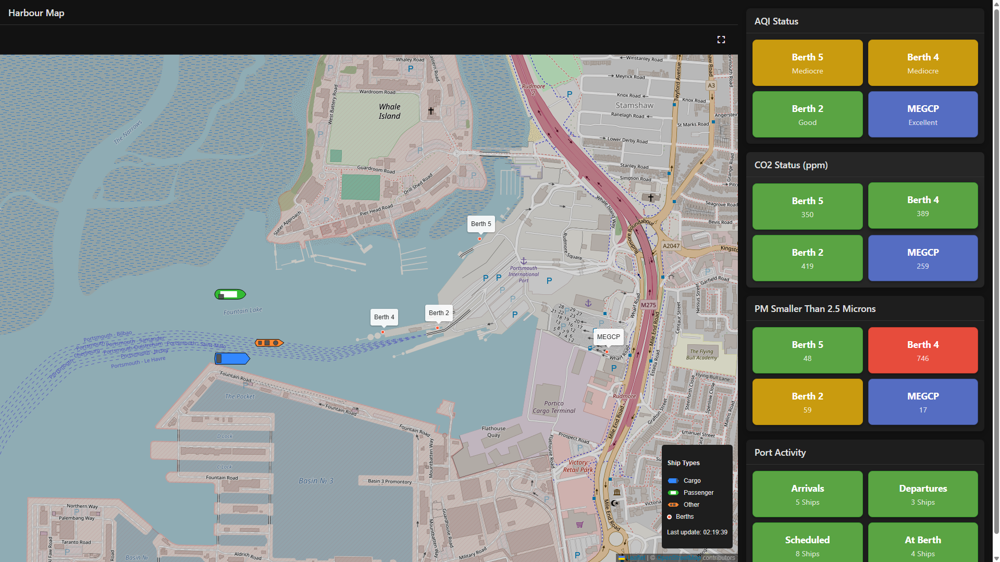

# A Human Friendly Data Dashboard

For this year of [HackPompey](https://hackpompey.co.uk/), the theme was [SeaChange](https://portsmouth-port.co.uk/about-us/sustainability/sea-change/). As a team, we were tasked with using data provided to us by a government funded organisation based in Portsmouth called "SeaChange". The data gathered from SeaChange was data such as Co2 readings from ports, weather data and ship entrance and departure times.

Identifying environmental problems requires data, but humans need data to be conveyed as information. Although specialists will have software to analyse and visualise the data that SeaChange provide, regular residents of Portsmouth won't. Therefore, as environmental issues such as Co2 emissions and air particulates concern the health of all residents of Portsmouth, it is vital this information is easily accessible and understandable so that residents are more educated to make political decisions. This was our mission with this project.

Our final product was a proof-of-concept data dashboard which visualises the impact that ships have on local air quality. As most ambitious hackathon projects go, we couldn't fit all the features we wanted to and the code wasn't our finest, however, to get a working prototype delivered in six hours was an accomplishment.

## How it Works

We first hand selected specific data from historical results to get a better idea of how both frontend and backend code would interact with data provided. With that information, we decided to generate data based on the data SeaChange provided. This is handled by our Express.js local server. We wanted to have some sort of moving element to the dashboard so we decided to make the ships move, because why not? Though these ships do move slowly, becThis data is served through an API to our frontend.

The frontend uses straight JavaScript to make calls to the local server and display ship data. This data contains longitude and latitude data alongside other information about the ship which we used to plot on a map. The cards located at the right side of the window shows data that might appear if live data were to be pumped into the dashboard, however, for proof-of-concept, this data was taken from the existing previous data provided and hardcoded to the page.



## Installation and Execution

### Installation
This project was built with [Node.js V23.10.0](https://nodejs.org/en/download), however, most versions should work okay.

* Clone the repository with:
```
git clone https://github.com/runtime-terr0rs/hack-pompey-2025.git
```

* Step into "server" directory:
```
cd server
```

* Install node modules:
```
npm i
```

* Run start script:
```
npm run start
```

### Execution
There is no server handler for the dashboard webpage, due to it being easy to quickly develop webpages on, we used the Visual Studio Code's live server to host the HTML page. Alternatively, simply open the webpage in your browser and it should work.

## Built With

* HTML/CSS

* JavaScript

* Node.js

* Express.js

## Future Work

* Connect to live data (A bit difficult)

* Add historic data view

* Some sort of ML prediction

## Closing Notes
Thank you very much to the HackPompey team and all the other participants of HackPompey 2025. It's always really fun to go and always managed so well.


## Authors

* Ethan Egerton ([@ethan-egerton](https://github.com/ethan-egerton))
* Jack Ramsay ([@jramsay21](https://github.com/jramsay21))
* Oliver Goggins ([@OGoggins](https://github.com/OGoggins))
* Theo Kinder ([@Theoryia](https://github.com/Theoryia))